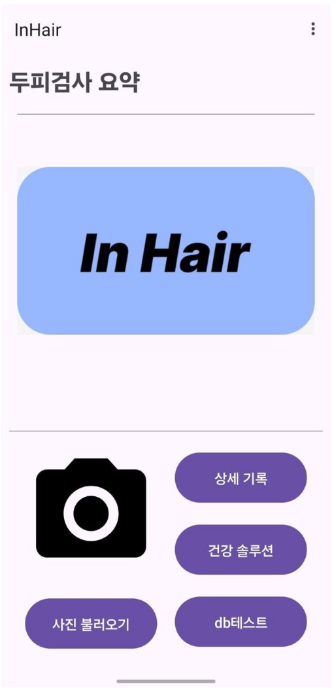
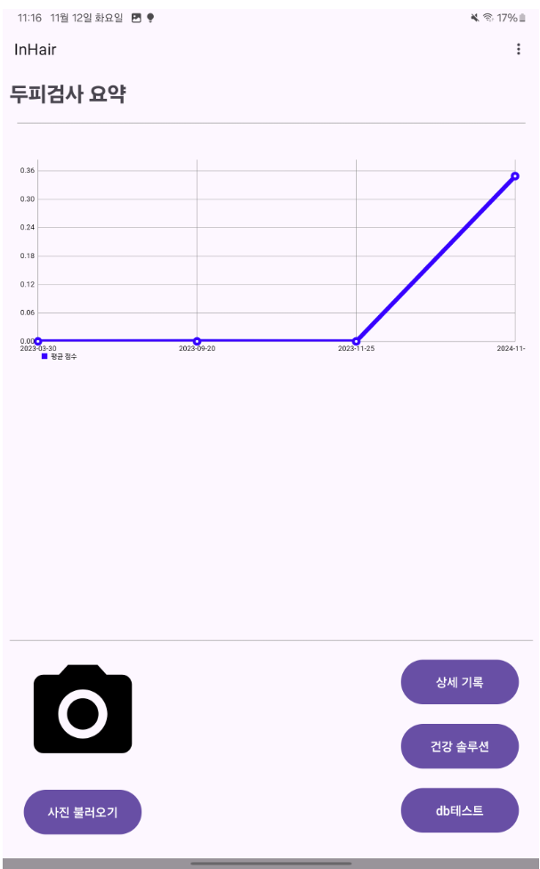
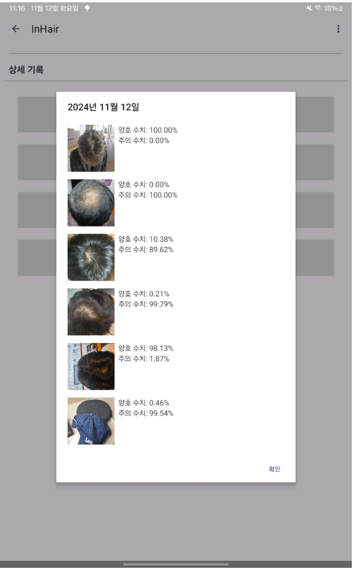
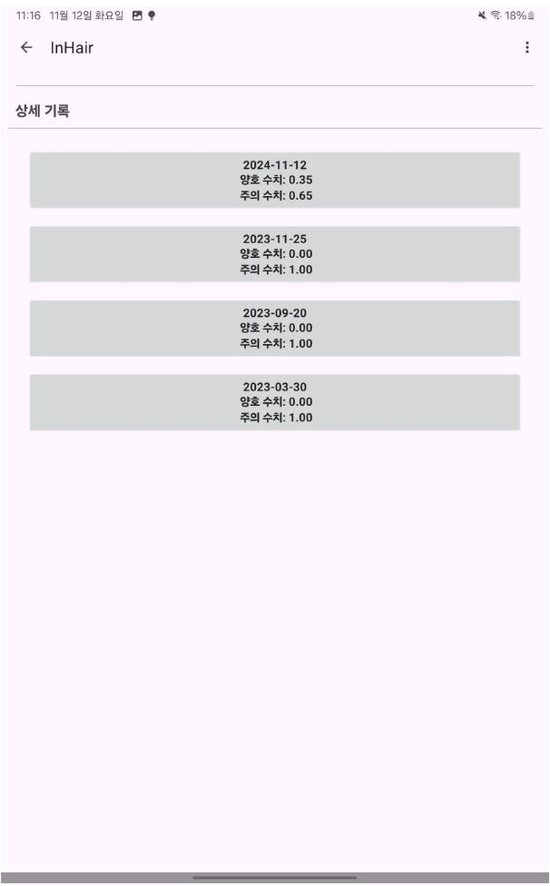
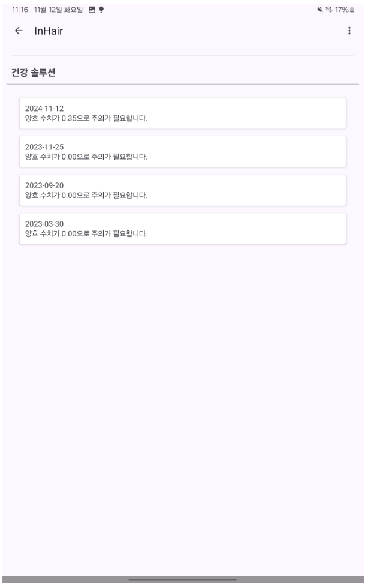
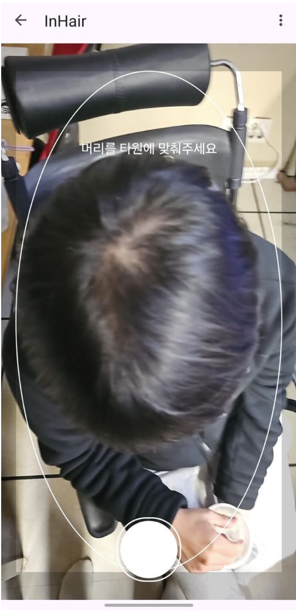

# 👨‍🦲 탈모 진단, 솔루션 제공 서비스 앱 InHair


 

- 배포 URL : https://drive.google.com/file/d/1QHplI3DMvmGXK2upUt-GtkSU0T345zXv/view?usp=sharing

<br>

## 프로젝트 소개

- InHair는 개인이 손쉽게 탈모 상태를 진단받고 간단한 솔루션을 제공받을 수 있는 AI기반 앱입니다.
- 개인의 정수리 사진을 등록함으로써 탈모 점수와 피드백을 확인할 수 있습니다.
- 탈모 점수의 변화와 과거 나의 모습과 현재 나의 모습을 비교할 수 있습니다.

<br>

## 팀원 구성

<div align="center">

| **주찬양** | **조경환** | **김규일** |

</div>

<br>

## 1. 개발 환경

- App: Kotlin, room, XML
- AI model: Tensorflow, Python
- 버전 및 이슈관리 : Github, Github Issues, Github Project
- 협업 툴 : Discord
- 서비스 배포 환경 : Local
- 디자인 : [Figma](https://www.figma.com/file/fAisC2pEKzxTOzet9CfqML/README(oh-my-code)?node-id=39%3A1814)
<br>

## 2. 채택한 개발 기술

### React, styled-component

- Kotlin 
          - 안드로이드 네이티브 앱 내에 있는 카메라 API 사용 및 개발 경험의 다양성을 고려한 언어 선택


<br>

## 3. 프로젝트 구조

```
C:.
│  AndroidManifest.xml
│  ic_launcher-playstore.png
│
├─assets
│      scalp_classification_model_J_20_500_GB_0.tflite
│
├─java
│  └─com
│      └─example
│          └─InHair
│              │  CamSfFragment.kt
│              │  DetailFragment.kt
│              │  GuideFrameView.kt
│              │  MainActivity.kt
│              │  MainFragment.kt
│              │  RoomTest.kt
│              │  SolutionFragment.kt
│              │  SplashActivity.kt
│              │
│              ├─data
│              │      PhotoData.kt
│              │      PhotoDataManager.kt
│              │
│              └─Room
│                      MyAppDatabase.kt
│                      MyDao.kt
│                      MyEntity.kt
│                      MyEntityAdapter.kt
│
└─res
    ├─drawable
    │      button_background_black_circle.xml
    │      button_ring.xml
    │      capture_button_background.xml
    │      ic_camera.xml
    │      ic_launcher_background.xml
    │      title.png
    │
    ├─drawable-v24
    │      ic_launcher_foreground.xml
    │
    ├─layout
    │      activity_main.xml
    │      activity_splash.xml
    │      content_main.xml
    │      data_room.xml
    │      dialog_photo_details.xml
    │      fragment_camerasurface.xml
    │      fragment_detail.xml
    │      fragment_main.xml
    │      fragment_solution.xml
    │      item_photo_detail.xml
    │      list_item_entity.xml
    │
    ├─menu
    │      menu_main.xml
    │
    ├─mipmap-anydpi-v26
    │      ic_launcher.xml
    │      ic_launcher_round.xml
    │
    ├─mipmap-hdpi
    │      ic_launcher.webp
    │      ic_launcher_foreground.webp
    │      ic_launcher_round.webp
    │
    ├─mipmap-mdpi
    │      ic_launcher.webp
    │      ic_launcher_foreground.webp
    │      ic_launcher_round.webp
    │
    ├─mipmap-xhdpi
    │      ic_launcher.webp
    │      ic_launcher_foreground.webp
    │      ic_launcher_round.webp
    │
    ├─mipmap-xxhdpi
    │      ic_launcher.webp
    │      ic_launcher_foreground.webp
    │      ic_launcher_round.webp
    │
    ├─mipmap-xxxhdpi
    │      ic_launcher.webp
    │      ic_launcher_foreground.webp
    │      ic_launcher_round.webp
    │
    ├─navigation
    │      nav_graph.xml
    │
    ├─values
    │      colors.xml
    │      dimens.xml
    │      strings.xml
    │      themes.xml
    │
    ├─values-land
    │      dimens.xml
    │
    ├─values-night
    │      themes.xml
    │
    ├─values-v23
    │      themes.xml
    │
    ├─values-w1240dp
    │      dimens.xml
    │
    ├─values-w600dp
    │      dimens.xml
    │
    └─xml
            backup_rules.xml
            data_extraction_rules.xml
            file_paths.xml

```

<br>

## 4. 역할 분담

### 🍊김규일

- **기능**
    - 페이지 : 메인, 카메라
    - 상세 기능: 페이지 연결, 추세 그래프, 카메라 구현 및 권한, 사진 전처리 및 저장
- **DB**
    - Android room을 이용한 로컬 DB 구현

<br>
    
### 👻조경환

- **UI**
    - 페이지 : 메인, 솔루션, 기록 페이지
- **기능**
    - 솔루션 페이지, 기록 페이지 기능 구현

<br>

### 😎주찬양

- **AI모델**
- 정수리를 통해 탈모 진행률을 진단하는 AI프로그램 설계, 학습

<br>


## 5. 개발 기간 및 작업 관리

### 개발 기간

- 전체 개발 기간 : 2024-09-25 ~ 2024-11-12

<br>

### 작업 관리

- discord를 통한 주간 회의 1회와 대면 회의 1회 총 주 2회로 진행

<br>


## 7. 페이지별 기능

### [초기화면]
- 서비스 접속 초기화면으로 splash 화면이 잠시 나온 뒤 다음 페이지가 나타납니다.
- 그간의 기록을 보여주는 그래프
- 촬영, 갤러리 호출, 솔루션, 기록페이지로 이동하는 버튼

| 초기화면 |
|----------|


<br>



<br>


| 기록 |
|----------|


<br>


<br>

| 솔루션 |
|----------|


<br>


| 카메라 |
|----------|


<br>


